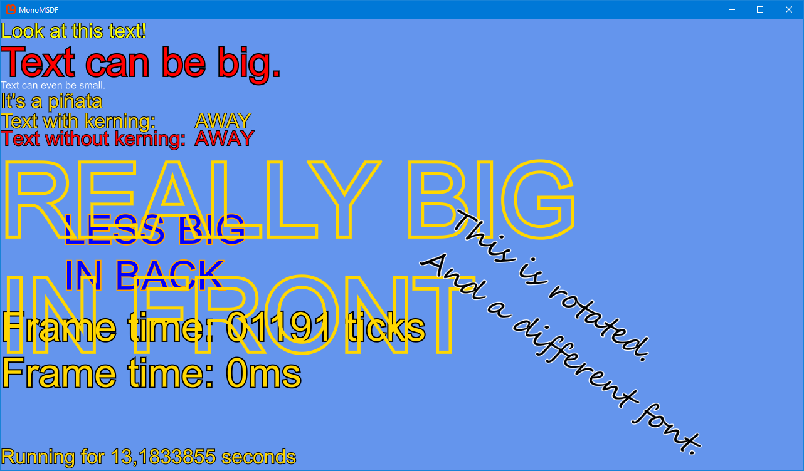

# Example

This is an example of my [text renderer for Monogame](https://github.com/Peewi/MSDF) being used in a separate project.



# Files
## FontExtension.dll
FontExtension.dll comes from the nuget package. It has to be referenced manually in the .mgcb file. **Because nuget packages are stored in the user folder (by default), you will have to manually update this reference to build this project.**

## msdf-atlas-gen.exe
msdf-atlas-gen.exe is used to generate the font atlas and layout information. It is available from the [msdf-atlas-gen releases page](https://github.com/Chlumsky/msdf-atlas-gen/releases). The path to msdf-atlas-gen.exe is set as a processor parameter for your font files. Or you can place it in your content folder and use the default path.

## Font files
Fonts are specified files with the extension `.bhfont` that contain JSON and should be added to the content project (mgcb file). Here is an example file:
```
{
	"path":"C:\\Windows\\Fonts\\arial.ttf",
	"ranges":[
		{
			"start":32,
			"end":"0xFF"
		},
		{
			"start":"←",
			"end":"↙"
		},
		{
			"start":"0x2000",
			"end":"0x200f"
		}
	]
}
```

"path" points to a font file and can be either absolute or relative.

"ranges" controls which characters are included in the font atlas, similar to Monogame's spritefonts. Any number of ranges can be added. The "start" and "end" values can be a single character, a character's unicode number or a character's hexadecimal number. Both "start" and "end" are inclusive.